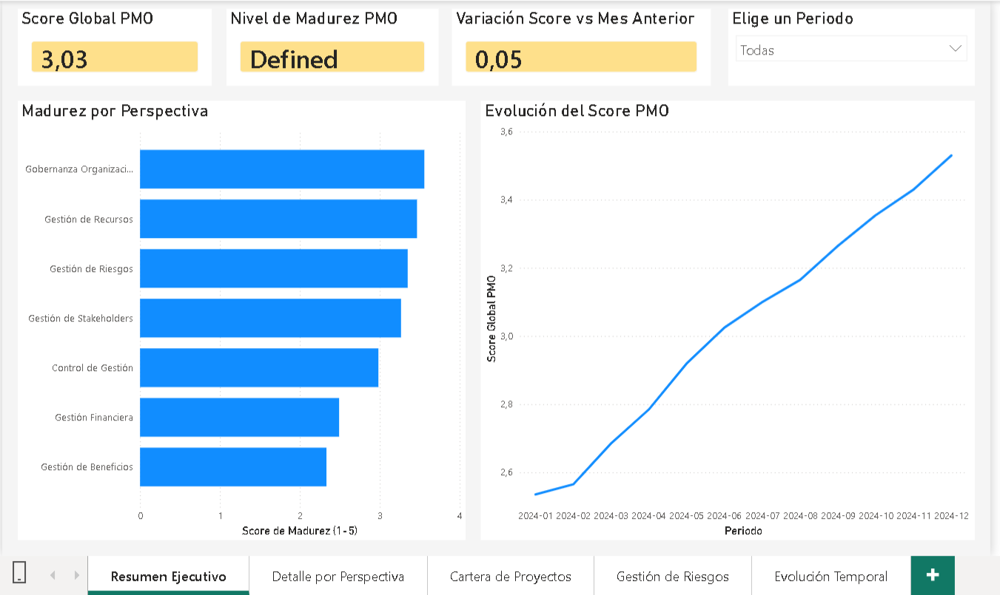

# PMO Maturity BI System — P3M3

A Business Intelligence system that automatically calculates the maturity level of a Project Management Office (PMO) from operational project data, without relying on self-assessment questionnaires.

Built with PostgreSQL 17, Power BI Desktop, and the [P3M3 maturity model](https://www.axelos.com/certifications/propath/p3m3-maturity-model) (AXELOS, 2015).

> 🇪🇸 **Sistema de Inteligencia de Negocio** que calcula automáticamente el nivel de madurez de una Oficina de Gestión de Proyectos (PMO) a partir de datos operativos, sin depender de cuestionarios de autoevaluación. Desarrollado con PostgreSQL 17, Power BI Desktop y el modelo P3M3 (AXELOS, 2015).



---

## ¿Qué hace?

- Calcula automáticamente **23 KPIs** distribuidos en las 7 perspectivas del modelo P3M3 (Gobernanza, Gestión, Beneficios, Riesgos, Stakeholders, Finanzas y Recursos)
- Produce un **score global de madurez ponderado** (escala 1-5) actualizado con cada nuevo periodo de datos
- Visualiza los resultados en un **dashboard interactivo de 5 páginas**: resumen ejecutivo, detalle por perspectiva, cartera de proyectos, gestión de riesgos y evolución temporal

## ¿Para quién es útil?

- **Equipos de PMO** que quieran sustituir las auditorías anuales de madurez por un seguimiento continuo basado en datos
- **Desarrolladores** que quieran explorar un ejemplo de star schema aplicado a un dominio de gestión de proyectos
- **Estudiantes** que busquen un proyecto de referencia completo con PostgreSQL + Power BI

---

## Uso rápido

**No hace falta desplegar nada para ver el dashboard.** El archivo `.pbix` incluye los datos simulados embebidos en modo Import:

1. Descarga `CM_Medicion_Madurez_PMO.pbix`
2. Ábrelo con [Power BI Desktop](https://powerbi.microsoft.com/desktop/) (versión mayo 2026 o posterior)
3. Listo

Si quieres conectar el sistema a tus propios datos, sigue las [instrucciones de despliegue](#despliegue-con-datos-propios) más abajo.

---

## Estructura del repositorio

```
├── 02_schema_postgresql.sql      # Esquema de la base de datos (star schema, 14 tablas + 3 vistas)
├── 03_datos_simulados.sql        # Dataset de ejemplo: 10 proyectos × 12 meses (2024)
├── CM_Medicion_Madurez_PMO.pbix  # Dashboard Power BI con datos embebidos
└── screenshots/
    └── dashboard_preview.png
```

---

## Despliegue con datos propios

### Requisitos

- [PostgreSQL 17+](https://www.postgresql.org/download/)
- [pgAdmin 4](https://www.pgadmin.org/)
- [Power BI Desktop](https://powerbi.microsoft.com/desktop/) (mayo 2026 o posterior)

### Pasos

**1. Crear la base de datos**

En pgAdmin, crea una base de datos nueva llamada `pmo_bi`.

**2. Crear el esquema**

Abre `02_schema_postgresql.sql` en el Query Tool de pgAdmin y ejecútalo (F5). Crea 7 tablas de dimensión, 7 tablas de hechos, 3 vistas analíticas e índices de rendimiento.

**3. Cargar el dataset de ejemplo**

Abre `03_datos_simulados.sql` en el Query Tool y ejecútalo. Para verificar que la carga fue correcta:

```sql
SELECT * FROM v_score_global_pmo ORDER BY anio, mes;
-- Debe devolver 12 filas con el score global de cada mes de 2024
```

**4. Conectar el dashboard**

Abre `CM_Medicion_Madurez_PMO.pbix`, ve a **Inicio → Transformar datos → Configuración del origen de datos** y actualiza:

| Parámetro | Valor |
|---|---|
| Servidor | `localhost` (o IP de tu servidor) |
| Base de datos | `pmo_bi` |

Haz clic en **Actualizar** para cargar tus datos.

---

## Modelo de datos

Star schema con `dim_tiempo` y `dim_proyecto` como dimensiones conformadas, compartidas entre todas las tablas de hechos.

```
dim_perspectiva ──┬──► fact_madurez_pmo
                  └──► fact_kpi_snapshot
dim_tiempo ───────┼──► fact_madurez_pmo
                  ├──► fact_proyecto_rendimiento
                  ├──► fact_riesgo
                  ├──► fact_stakeholder
                  ├──► fact_beneficio
                  ├──► fact_recurso_asignacion
                  └──► fact_kpi_snapshot
dim_proyecto ─────┼──► fact_proyecto_rendimiento
                  ├──► fact_riesgo
                  ├──► fact_stakeholder
                  ├──► fact_beneficio
                  ├──► fact_recurso_asignacion
                  └──► fact_kpi_snapshot
dim_kpi ──────────►  fact_kpi_snapshot
dim_recurso ──────►  fact_recurso_asignacion
dim_tipo_riesgo ──►  fact_riesgo
dim_nivel_madurez ►  fact_madurez_pmo
```

---

## Stack tecnológico

- **Base de datos:** PostgreSQL 17 — star schema con columnas generadas (`GENERATED ALWAYS AS STORED`) para índices EVM
- **Dashboard:** Power BI Desktop — 9 medidas DAX centralizadas en tabla `_Medidas`
- **Modelo de madurez:** P3M3 v3.0 (AXELOS, 2015)

---

## Licencia

Proyecto académico de libre uso con fines educativos y de referencia. Si lo reutilizas o adaptas, se agradece la atribución.

---

**Autor:** Alberto González-Calero López · [Universidad Nebrija](https://www.nebrija.com) · TFG Ingeniería Informática · 2026
